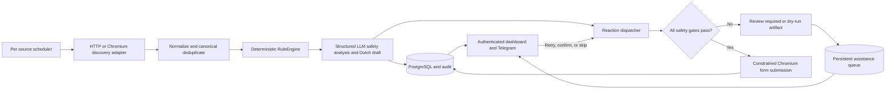

# Architecture

## Operational pipeline

Every enabled source runs independently on a configurable APScheduler interval (one minute by
default):

`app.services.pipeline.Pipeline` extends the listing pipeline with synchronous dispatch for a newly
created listing. This starts reaction preparation in the same source run rather than waiting for
another job. A unique submission claim on `canonical_property_id` supplies cross-source idempotency.
The scheduler reconciles database source settings every minute and retries recoverable failures every
three minutes, so source-mode changes do not require an application restart.

## Source boundaries

Discovery adapters implement `SourceAdapter` and return validated `NormalizedListing` records. Parser
logic remains fixture-testable. Browser discovery is used where public result pages need JavaScript;
it is private, timeout-bounded, closed in `finally`, and never bypasses challenges.

Reaction behavior is separately defined in `REACTION_SPECS`. Source hints locate login/action/form
surfaces, while one conservative field mapper controls what may be entered. Supporting a new agency
requires both a discovery adapter and explicit reaction-flow inspection. An unknown source or changed
form stops instead of falling back to broad clicking.

Campus Groningen is the current public destination linked from Groningse Panden. Its registration/shop
flow remains manual. Pandomo's old feed is monitored as legacy; its reaction flow also remains manual
until a current safe surface is verified.

## LLM boundary

`ListingLLMService` routes ordinary, incomplete, and ambiguous text to cheap, standard, and escalation
models. OpenAI Responses and Anthropic Messages require schema-constrained output, validated again by
Pydantic. Inputs are allowlisted public listing facts and minimal non-financial applicant facts.

Deterministic rules remain authoritative. The LLM may downgrade `AUTO_REACT` to `REVIEW`, never promote
a listing or change criteria. An unavailable, invalid, or review-requesting LLM result prevents
automatic dispatch. Credentials, session state, private contact data, URLs, finances, and guarantor
details never enter the model request.

## Reaction state, assistance, and privacy

Contact details, source credentials, and Playwright storage state are Fernet-encrypted in PostgreSQL.
`submissions` records only the exact outbound message, allowlisted field names, state/outcome codes,
browser metadata, and artifact paths. It never stores form-contact values in audit JSON. Screenshots
may contain those values and live in the protected artifacts volume.

The browser stops on CAPTCHA, file upload, payment/registration, sensitive identity/income fields,
legal checkboxes, unknown required fields, or an unrecognized form. A real click is possible only when
the listing, LLM, source mode, global flag, and dry-run gates all agree.

`AssistedReactionService` turns every browser `REVIEW_REQUIRED` or failed outcome into one durable
`assistance_requests` row per submission. It optionally notifies Telegram, exposes artifacts only
through authenticated same-application routes, and lets the user retry, confirm a manual send, or
skip. Confirming a manual send updates the same canonical submission claim instead of creating a
second response.
